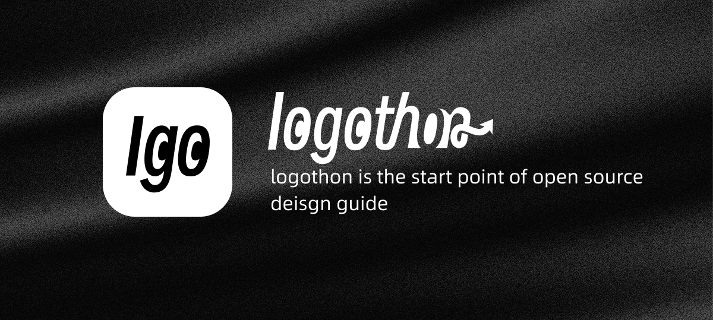

-  [logothon](https://logothon.pages.dev/)  
- The logo is based on:[smiley-sans](https://github.com/atelier-anchor/smiley-sans)

### What is Logothon

**Logothon** is a biannual design initiative I started to give back to the open-source world— [Designing Logos for Open Source Projects](https://pick-up-the-light.pages.dev/en/technology-design/logothon-designing-logos-for-open-source-projects/)
and at the same time, to push my own design craft through real, meaningful challenges.
Each Logothon is a short, intensive design sprint focusing on creating high-quality logos for open projects that need them.

---

### How it works

1. **Finding projects**
   I regularly browse GitHub issues containing the keyword “need logo”, focusing on those posted within the last month.

2. **Selecting meaningful work**
   Projects related to education, sustainability, or personal growth tend to attract my attention, but I also look for ideas that feel challenging or creatively inspiring.

3. **Design process**
   I usually create one to three proposals—sometimes more—depending on the scope and potential of the project.
   Even though Logothon is entirely non-commercial, the design quality and rigor are held to the same standards as my commissioned work.

4. **Copyright and contribution**
   The resulting logo follows the project’s existing license.
   I only retain authorship credit, usually through a comment in the SVG source or explicit attribution.
   Once a logo is accepted, it’s contributed via a pull request—everything happens transparently on GitHub.

5. **Outside the cycle**
   If you like my approach and want your project considered, feel free to open an issue describing your goals.
   During the next Logothon cycle, I’ll review these first.

---

### Logothon schedule

The event happens twice a year—**March** and **September**.
Each cycle runs about a week of intensive creation, typically supporting 6–10 projects.
Follow-up revisions and discussions usually continue for another few weeks.

---

### Commissioned work

Beyond Logothon, I also accept [logo commissions](https://ko-fi.com/libregd), especially from open-source or public-minded projects.
If your project requires dedicated design time or faster delivery, you’re welcome to request a paid collaboration.

